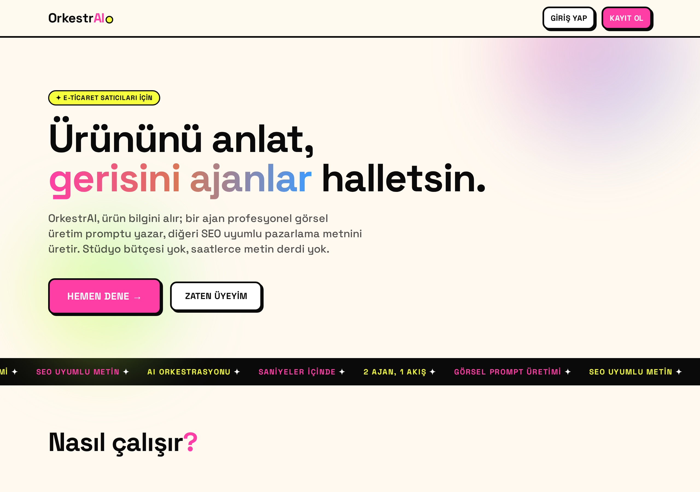
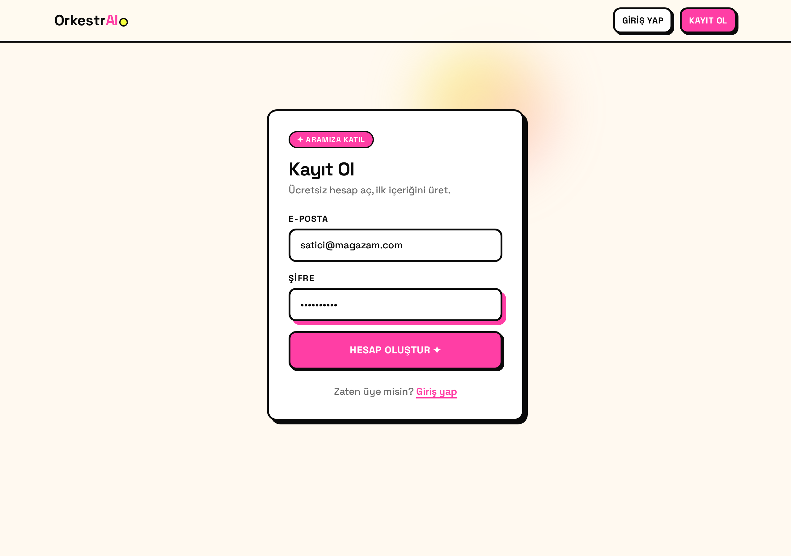
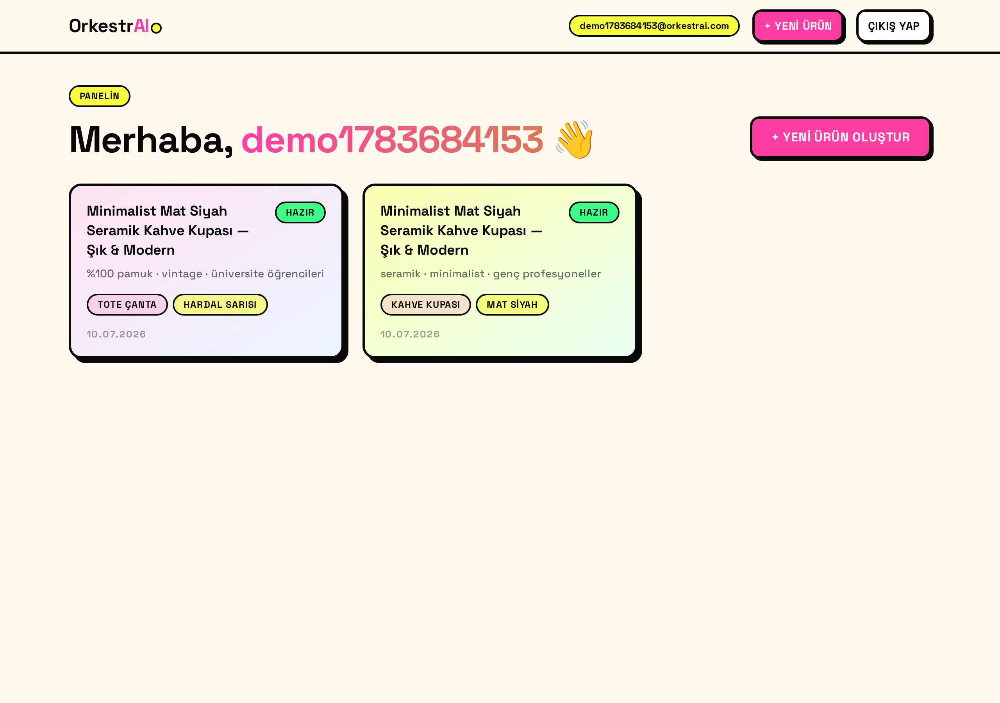
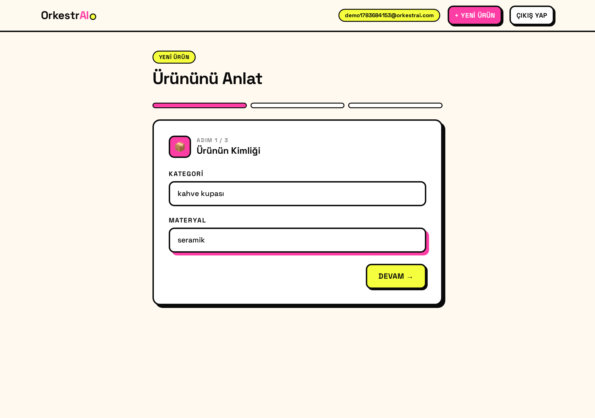
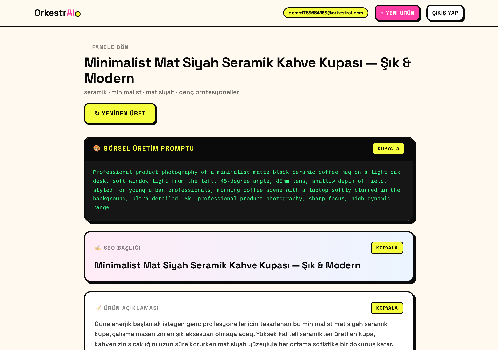

# 🎭 OrkestrAI — Kullanım Kılavuzu

> **E-Ticaret İçin Uçtan Uca Ürün Görselleştirme ve Pazarlama Ağı**
>
> Bu belge; projenin ne işe yaradığını, nasıl çalıştığını, hangi teknolojilerle **neden** kurulduğunu, nasıl kurulup çalıştırılacağını, mevcut durumda nelerin eksik olduğunu ve yol haritasını anlatır. Kısa kurulum + deployment özeti için ayrıca [ORKESTRAI.md](ORKESTRAI.md) dosyasına bakabilirsiniz. (Depo kökündeki [README.md](README.md) ise ekibin scrum/sprint dokümanıdır.)

---

## 📌 İçindekiler

1. [Proje Ne Yapar?](#1-proje-ne-yapar)
2. [Ekran Görüntüleri](#2-ekran-görüntüleri)
3. [Nasıl Çalışır? (Mimari & Akış)](#3-nasıl-çalışır-mimari--akış)
4. [Teknoloji Yığını — Ne İçin Ne Kullandık?](#4-teknoloji-yığını--ne-için-ne-kullandık)
5. [Kurulum ve Çalıştırma](#5-kurulum-ve-çalıştırma)
6. [Nasıl Kullanılır? (Adım Adım)](#6-nasıl-kullanılır-adım-adım)
7. [Şu Anki Durum — Neler Var?](#7-şu-anki-durum--neler-var)
8. [Neler Eksik / Neler Eklenebilir?](#8-neler-eksik--neler-eklenebilir)
9. [Yol Haritası](#9-yol-haritası)
10. [Proje Yapısı](#10-proje-yapısı)

---

## 1. Proje Ne Yapar?

Kişiselleştirilmiş ürünler veya butik tasarımlar satan e-ticaret satıcıları, **her ürün için profesyonel görsel ve pazarlama metni hazırlarken zaman ve bütçe kaybeder.** OrkestrAI bu sorunu iki yapay zeka ajanını bir **orkestrasyon akışıyla** birbirine bağlayarak çözer:

- 🎨 **Designer Agent** — Satıcının girdiği temel ürün bilgisinden (materyal, tarz, renk, kategori, kullanım amacı, hedef kitle) yola çıkıp, Midjourney/DALL·E gibi görsel üretim modellerine verilebilecek, **prompt-engineering standartlarına uygun, detaylı İngilizce bir görsel üretim promptu** üretir.
- ✍️ **Copywriter Agent** — Bu görsel promptunu + orijinal ürün bilgisini alıp **SEO uyumlu bir ürün başlığı, 150–200 kelimelik satış odaklı açıklama ve 5 anahtar kelime** yazar.

Satıcı sadece ürününü birkaç kelimeyle tarif eder; gerisini ajanlar halleder.

---

## 2. Ekran Görüntüleri

### Landing / Hero
Ürünün ne yaptığını anlatan çarpıcı giriş, "Hemen Dene" CTA'sı ve akan (marquee) şerit.



### Kayıt / Giriş
JWT tabanlı e-posta + şifre authentication; markaya uygun neo-brutalist form.



### Dashboard
Kullanıcının ürünlerini canlı gradient'li kart grid'i olarak gösterir; her kart "Hazır / Taslak" durumunu rozetle belirtir.



### Ürün Oluştur (3 Adımlı Akış)
Materyal, tarz, renk, kategori, kullanım amacı ve hedef kitleyi toplayan animasyonlu multi-step form.



### Sonuç Sayfası
Üretilen görsel promptu kopyalanabilir bir kod bloğunda; SEO başlığı, açıklama ve anahtar kelimeler düzenli kartlarda.



> Tüm sonuç sayfasının uzun görünümü: [docs/screenshots/05-result-full.png](docs/screenshots/05-result-full.png)

---

## 3. Nasıl Çalışır? (Mimari & Akış)

```
┌─────────────────────────────────────────────────────────────┐
│  FRONTEND  (React + TS + Vite + Tailwind + Framer Motion)    │
│  Landing · Auth · Dashboard · Ürün Oluştur · Sonuç           │
└───────────────┬─────────────────────────────────────────────┘
                │  fetch + JWT (Authorization: Bearer)
                ▼
┌─────────────────────────────────────────────────────────────┐
│  BACKEND  (FastAPI)                                          │
│                                                             │
│   routes/  ──►  auth (register/login)  ·  products (CRUD)   │
│      │                                                      │
│      ▼                                                      │
│   services/orchestrator.py                                  │
│      │  1) designer_agent.generate_image_prompt(product)   │
│      │  2) copywriter_agent.generate_marketing_copy(...)   │
│      ▼                                                      │
│   agents/llm_client.py  ──►  OpenAI API (gpt-4o-mini)      │
│                                                             │
│   SQLAlchemy ORM  ──►  SQLite (lokal) / PostgreSQL (prod)   │
└─────────────────────────────────────────────────────────────┘
```

**Orkestrasyon akışı (`/api/products/{id}/generate`):**

1. Kullanıcı ürün bilgisini kaydeder (`POST /api/products`).
2. `generate` çağrısında **orchestrator** devreye girer:
   - Önce **Designer Agent** çalışır → görsel prompt üretir.
   - Bu prompt, **Copywriter Agent**'a girdi olur → SEO metni üretir.
3. Sonuç veritabanına kaydedilir ve birleşik JSON olarak döner.

Bu zincirleme yapı sayesinde copywriter, designer'ın "gördüğü" sahneyle **tutarlı** bir metin yazar.

---

## 4. Teknoloji Yığını — Ne İçin Ne Kullandık?

### Backend

| Teknoloji | Ne için kullandık? | Neden? |
|---|---|---|
| **Python 3.10+** | Backend dili | AI/LLM ekosisteminin ana dili; `openai` SDK'sı native. |
| **FastAPI** | REST API framework | Otomatik OpenAPI/Swagger dokümantasyonu, `Depends` ile temiz dependency injection, async destek ve Pydantic entegrasyonu. |
| **Pydantic v2** | Request/response validasyonu | Gelen veriyi tip güvenli doğrular (`EmailStr`, alan uzunlukları); hatalı girdiyi otomatik 422 ile reddeder. |
| **SQLAlchemy 2.0** | ORM / veritabanı katmanı | Aynı kod hem SQLite hem PostgreSQL ile çalışır; ham SQL yazmadan ilişkiler (User↔Product) yönetilir. |
| **openai SDK** | LLM çağrıları | Designer & Copywriter ajanlarının `chat.completions` çağrıları. Model tek bir env değişkeniyle (`OPENAI_MODEL`) değişir. |
| **passlib + bcrypt** | Şifre hash'leme | Şifreler asla düz metin saklanmaz; endüstri standardı bcrypt ile hash'lenir. |
| **python-jose** | JWT üretimi/doğrulaması | Stateless authentication; token imzalanır ve korumalı route'larda doğrulanır. |
| **pytest + httpx** | Birim & entegrasyon testleri | Ajanlar, orchestrator ve API uçları için hızlı, mock'lanabilir testler. |
| **uvicorn** | ASGI sunucusu | FastAPI'yi production'da `$PORT` üzerinden ayağa kaldırır. |

### Frontend

| Teknoloji | Ne için kullandık? | Neden? |
|---|---|---|
| **React 18/19** | UI kütüphanesi | Bileşen tabanlı, geniş ekosistem. |
| **TypeScript** | Tip güvenliği | API tipleri (`Product`, `User`) derleme zamanında doğrulanır; hataları erken yakalar. |
| **Vite** | Build & dev sunucusu | Anında HMR, hızlı build; modern ES modülleri. |
| **Tailwind CSS** | Stil sistemi | Marka renklerini (`pink`, `lemon`, `claude`) ve neo-brutalist kartları tutarlı utility'lerle kurar. |
| **Framer Motion** | Animasyonlar | Sayfa geçişleri, kart hover eğimleri, adım geçişleri ve markaya uygun "zıplayan blok" loader'ı. |
| **React Router** | Sayfa yönlendirme | Korumalı route'lar (giriş yapmadan dashboard'a erişilemez). |
| **Space Grotesk** (Google Font) | Tipografi | Büyük, güçlü, modern başlıklar için. |

### Tasarım Dili
Neo-brutalist tema: **kalın siyah kenarlıklar + ofset gölgeler**, fosforlu pembe / limon sarısı / Claude turuncusu palet, canlı gradient bloklar, hover'da eğilen kartlar. Amaç: "okul projesi CRUD arayüzü" değil, **gerçek bir SaaS ürünü** hissi.

---

## 5. Kurulum ve Çalıştırma

### Gereksinimler
- **Python 3.10+** (3.11+ önerilir)
- **Node.js 20+**
- **Bir OpenAI API anahtarı** (gerçek üretim için; testler için gerekmez)

### 1) Backend

```bash
cd backend
python3 -m venv .venv
source .venv/bin/activate          # Windows: .venv\Scripts\activate
pip install -r requirements.txt

# Ortam değişkenleri (bkz. kökteki .env.example)
export OPENAI_API_KEY="sk-..."
export JWT_SECRET="$(openssl rand -hex 32)"

uvicorn app.main:app --reload --port 8000
```

- API: http://localhost:8000
- Swagger dokümantasyonu: http://localhost:8000/docs
- `DATABASE_URL` verilmezse otomatik olarak SQLite (`backend/orkestrai.db`) kullanılır.

### 2) Frontend

```bash
cd frontend
npm install
npm run dev
```

- Uygulama: http://localhost:5173
- Backend farklı adresteyse `frontend/.env` içine `VITE_API_URL=...` ekleyin.

### 3) Testler

```bash
cd backend
.venv/bin/python -m pytest tests/ -v
```

LLM çağrıları testlerde mock'lanır → **API anahtarı olmadan** da tüm testler geçer (15 test).

---

## 6. Nasıl Kullanılır? (Adım Adım)

1. **Kayıt ol** → e-posta + şifre ile hesap oluştur (`/register`).
2. **Dashboard**'a yönlendirilirsin → ürünlerin burada listelenir.
3. **"+ Yeni Ürün Oluştur"** → 3 adımlı formu doldur:
   - Adım 1: Kategori + Materyal
   - Adım 2: Tarz + Renk
   - Adım 3: Kullanım Amacı + Hedef Kitle
4. **"Üret ✦"** → ajanlar çalışır (birkaç saniye).
5. **Sonuç sayfası** açılır:
   - Görsel promptunu **kopyala** → Midjourney/DALL·E'ye yapıştır.
   - SEO başlığı, açıklama ve anahtar kelimeleri **kopyala** → ürün sayfana ekle.
6. İstersen **"↻ Yeniden Üret"** ile farklı bir varyasyon al.

---

## 7. Şu Anki Durum — Neler Var?

✅ İki AI ajanı + orchestrator (zincirleme çalışıyor)
✅ JWT tabanlı authentication (register/login), bcrypt hash
✅ Kullanıcıya bağlı ürünler (her satıcı yalnız kendi ürünlerini görür)
✅ REST API (products CRUD + generate)
✅ SQLite (lokal) / PostgreSQL (prod) desteği
✅ İddialı, responsive, animasyonlu SaaS arayüzü (5 sayfa)
✅ Hata yönetimi (LLM hatası → kullanıcı dostu mesaj, sistem çökmez)
✅ Birim & entegrasyon testleri (15 test)
✅ Railway'e deploy hazır yapılandırma (Procfile / railway.json / Dockerfile)
✅ Görsel üretim için **adapter pattern** (ileride gerçek API'ye kolay bağlanır)

---

## 8. Neler Eksik / Neler Eklenebilir?

Aşağıdakiler **bilinçli olarak kapsam dışı** bırakıldı veya bir sonraki adım olarak eklenebilir:

### Kısa vadede eklenebilecekler
- 🖼️ **Gerçek görsel üretimi** — Şu an `image_adapter.py` mock URL döndürüyor. `DalleImageGenerator` sınıfı yazılıp `generate()` içinde `client.images.generate(...)` çağrılarak gerçek görsel üretilebilir (yapı hazır).
- 🔒 **httpOnly cookie ile token** — Token şu an `localStorage`'da. XSS'e karşı daha güvenli olan httpOnly + Secure cookie yaklaşımına geçilebilir (README'de not var).
- ✏️ **Ürün düzenleme / silme** — Şu an oluştur + üret var; update/delete uçları eklenebilir.
- 📋 **Üretim geçmişi** — Aynı ürün için birden çok üretim varyasyonunu saklama.
- ⏳ **Rate limiting** — OpenAI maliyetini kontrol için kullanıcı başına istek limiti.

### Orta / uzun vadede
- 🌐 Çoklu dil desteği (şu an metinler TR, promptlar EN).
- 🛒 Shopify / Etsy / WooCommerce entegrasyonu (üretilen içeriği doğrudan mağazaya gönderme).
- 👥 Rol tabanlı yetkilendirme (takım/ajans hesapları, admin paneli).
- 💳 Ödeme & abonelik (kullanım bazlı fiyatlandırma).
- 📊 Analitik (hangi promptlar daha çok dönüşüm sağlıyor).
- 🧪 Frontend test coverage (Vitest / Playwright E2E).
- 🔁 CI/CD pipeline (GitHub Actions → otomatik test + deploy).

### Bilinçli kapsam dışı (bu aşamada yapılmadı)
- Gerçek ödeme/e-ticaret entegrasyonu
- Sosyal medya ile giriş (Google/Apple)
- Rol tabanlı admin paneli

---

## 9. Yol Haritası

| Faz | Hedef | Durum |
|---|---|---|
| **v1.0 (mevcut)** | Auth + 2 ajan + orchestrator + SaaS arayüz + Railway deploy | ✅ Tamamlandı |
| **v1.1** | Gerçek görsel üretimi (DALL·E), ürün düzenle/sil, httpOnly cookie | 🔜 Planlı |
| **v1.2** | Üretim geçmişi, rate limiting, frontend testleri, CI/CD | 🔜 Planlı |
| **v2.0** | Mağaza entegrasyonları (Etsy/Shopify), abonelik & ödeme, analitik | 🗺️ Vizyon |

---

## 10. Proje Yapısı

```
orkestrai/
├── backend/
│   ├── app/
│   │   ├── main.py                 # FastAPI uygulaması + CORS
│   │   ├── config.py               # Ortam değişkenleri
│   │   ├── database.py             # SQLAlchemy engine/session
│   │   ├── models.py               # User + Product ORM modelleri
│   │   ├── schemas.py              # Pydantic şemaları
│   │   ├── auth/
│   │   │   ├── security.py         # bcrypt hash + JWT
│   │   │   └── dependencies.py     # get_current_user (korumalı route)
│   │   ├── agents/
│   │   │   ├── llm_client.py       # Ortak OpenAI katmanı
│   │   │   ├── designer_agent.py   # Görsel prompt üretimi
│   │   │   ├── copywriter_agent.py # SEO metin üretimi
│   │   │   └── image_adapter.py    # Görsel API adapter (mock)
│   │   ├── services/
│   │   │   ├── orchestrator.py     # İki ajanı zincirler
│   │   │   └── product_service.py  # Ürün iş mantığı
│   │   └── routes/
│   │       ├── auth.py             # register / login / me
│   │       └── products.py         # CRUD + generate
│   ├── tests/                      # pytest (agents, orchestrator, api)
│   ├── requirements.txt
│   ├── Procfile · railway.json · Dockerfile   # Railway deploy
│
├── frontend/
│   ├── src/
│   │   ├── pages/                  # Landing, Auth, Dashboard, Create, Result
│   │   ├── components/             # Navbar, Loader, ErrorAlert, ProtectedRoute
│   │   ├── context/AuthContext.tsx # Oturum yönetimi
│   │   └── lib/                    # api.ts (fetch + JWT), types.ts
│   ├── tailwind.config.js          # Marka renkleri & tema
│   └── railway.json
│
├── docs/screenshots/               # Bu kılavuzdaki görseller
├── README.md                       # Ekibin scrum/sprint dokümanı
├── ORKESTRAI.md                    # Teknik kurulum + deploy talimatları
├── kullanimKilavuzu.md             # Bu dosya (detaylı kullanım kılavuzu)
└── .env.example                    # Ortam değişkeni şablonu
```

---

<div align="center">

**OrkestrAI** — Ürününü anlat, gerisini ajanlar halletsin. 🎭

</div>
